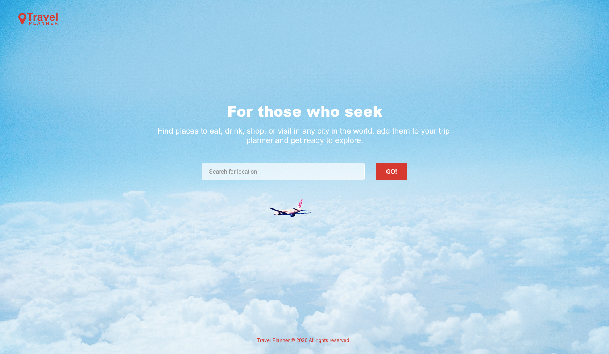
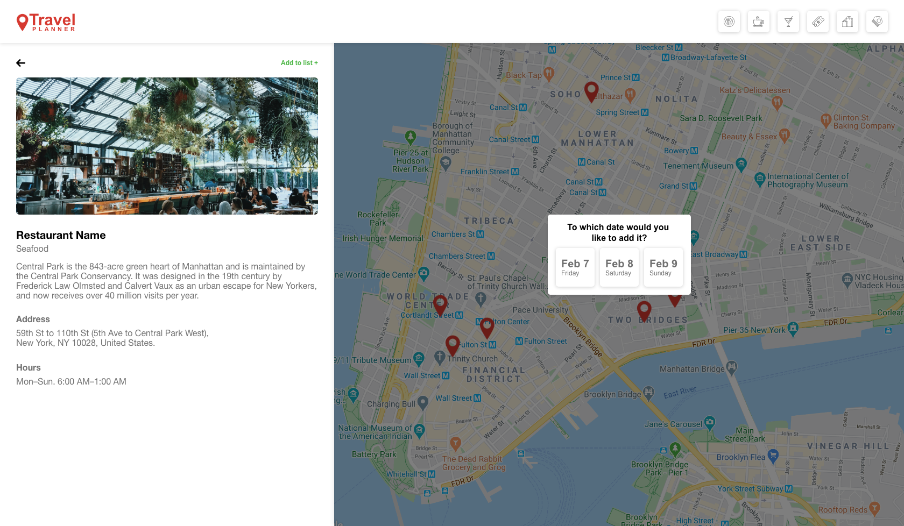
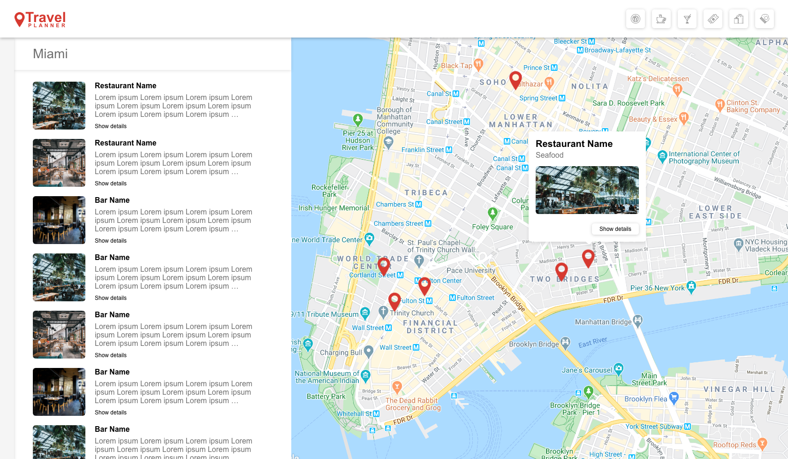
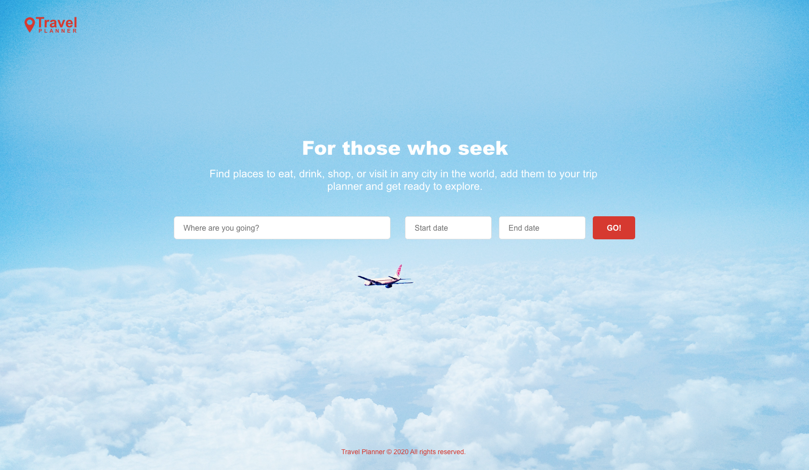
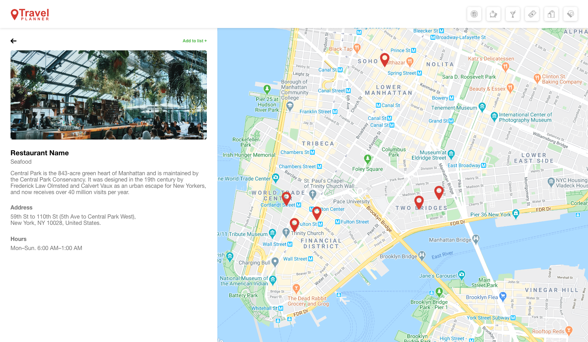
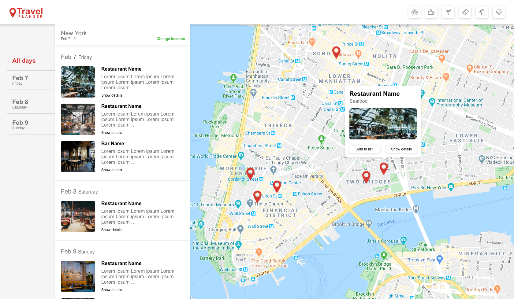

# Travel Planner App

Right click on this => ([Link](https://carolunasilver.github.io/travel-planner/)) and select "Open Link in New Tab" to checkout the Live version.

## Project Description

This application allows you to search for venues in Miami, FL. There are different venue categories sucha as bars, restaurants, hotels and others, it also allows you to save a list of venues that you would want to visit while your stay in Miami.

### Built with
* [React](https://reactjs.org/)
* [React Bootstrap](https://react-bootstrap.github.io/)  
* [Foursquare API](https://developer.foursquare.com/) - All venue data
* [Google Maps API](https://cloud.google.com/maps-platform/) - Additional street view images

### Other tools used
* [Adobe Xd](https://xd.adobe.com/) - Prototype
* [React Font Awesome](https://fontawesome.com/how-to-use/on-the-web/using-with/react) - Icons

### Prototype ([Link](https://xd.adobe.com/view/90ff7d9b-0d69-4393-521e-4964ed110cb2-e6ce/))

## Prototype Screens
### Home Page


### Map Details


### Map List


### Getting Started
* Clone or download the repository
* Then install all project dependencies
```
cd travel-planner
yarn install
```
* Run the app with 
```
yarn start
```
## Future Release
### Home Page


### Map Details with Date Modal


### Map List


## The Team
* Sthefany Azevedo [LinkedIn](https://www.linkedin.com/in/sthefany-azevedo-723b0b89/)
* Carolina Silver [LinkedIn](https://www.linkedin.com/in/carolinasilver/)
